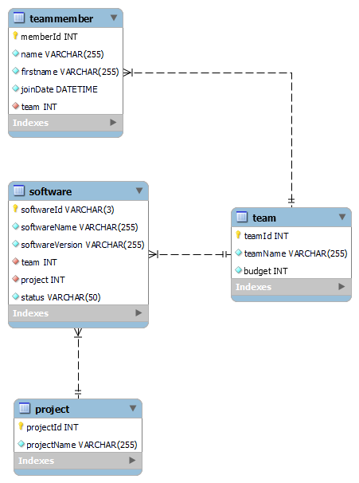

# Project Name

This project is a Spring Boot application that provides a RESTful API for team and project management. It is designed to store and manage all project and its team members. The application is built using Java and follows the principles of Spring Boot to provide a robust and scalable solution.

## Prerequisites

Before running the application, ensure that you have the following prerequisites installed:

- Java Development Kit (JDK) version [20.0.1](https://www.oracle.com/java/technologies/javase/jdk20-archive-downloads.html)
- Apache Maven version [3.8.1](https://archive.apache.org/dist/maven/maven-3/)
- MySQL Server [8.0.31](https://downloads.mysql.com/archives/community/)

## Installation

To install and run the application, follow these steps:

1. Clone the repository:

   ```shell
   git clone [https://github.com/class-Api2021a/M295-Noah-Bargisen.git]
   ```

2. Navigate to the project directory:

   ```shell
   cd [project directory]
   ```

3. Build the application using Maven:

   ```shell
   mvn clean install
   ```

4. Start the application:

   ```shell
   java -jar target/[project-name].jar
   ```

   Replace `[project-name]` with the actual name of your JAR file.
   Default name is `M295_ProjectApplication-0.0.1-SNAPSHOT.jar`.

5. The application is now running on port 8080.

## Configuration

The application can be configured through the following properties:

- `server.port`: The port on which the application is running. Default is `8080`.
- `spring.datasource.url`: The URL of the MySQL database. Default is `jdbc:mysql://localhost:3306/M295`.
- `spring.datasource.username`: The username for the MySQL database. Default is `root`.
- `spring.datasource.password`: The password for the MySQL database. Default is `1234`.


You can modify these properties according to your specific requirements in the [application.properties](src/main/resources/application.properties) file.

## Usage

To use the application, follow these steps:

1. Access the API endpoints using the base URL: `http://localhost:[port]`.
2. Endpoints are documented in the [API documentation](#api-documentation).
3. The authentication method is basic authentication with these credentials.
    Username: `user`
    Password: `password`
    
## Database Documentation



```sql
CREATE DATABASE IF NOT EXISTS M295;
USE M295;

CREATE TABLE IF NOT EXISTS TEAMMEMBER
(
    `memberId`  INT          NOT NULL AUTO_INCREMENT,
    `name`      VARCHAR(255) NOT NULL,
    `firstname` VARCHAR(255) NOT NULL,
    `joinDate`  DATETIME     NOT NULL,
    `team`      INT          NOT NULL,
    PRIMARY KEY (memberId)
);


CREATE TABLE IF NOT EXISTS TEAM
(
    `teamId`   INT          NOT NULL AUTO_INCREMENT,
    `teamName` VARCHAR(255) NOT NULL,
    `budget`   INT          NOT NULL,
    PRIMARY KEY (teamId)
);

CREATE TABLE IF NOT EXISTS SOFTWARE
(
    `softwareId`      VARCHAR(3)   NOT NULL,
    `softwareName`    VARCHAR(255) NOT NULL,
    `softwareVersion` VARCHAR(255) NOT NULL,
    `team`            INT          NOT NULL,
    `project`         INT          NOT NULL,
    `status`          VARCHAR(50)  NOT NULL,
    PRIMARY KEY (softwareId)
);


CREATE TABLE IF NOT EXISTS PROJECT
(
    `projectId`   INT          NOT NULL AUTO_INCREMENT,
    `projectName` VARCHAR(255) NOT NULL,
    PRIMARY KEY (projectId)
);


ALTER TABLE TEAMMEMBER
    ADD CONSTRAINT FK_TEAMMEMBER FOREIGN KEY (team) REFERENCES TEAM (teamId);
ALTER TABLE SOFTWARE
    ADD CONSTRAINT FK_TEAM FOREIGN KEY (team) REFERENCES TEAM (teamId);
ALTER TABLE SOFTWARE
    ADD CONSTRAINT FK_PROJECT FOREIGN KEY (project) REFERENCES PROJECT (projectId);
```

## API Documentation

The API documentation for this project is available [OpenAPI Specification](src/main/resources/openapi.md). It provides detailed information about each endpoint, request/response formats, and any required authentication or authorization.

## Contributing

We welcome contributions to improve this project. To contribute, please follow these guidelines:

1. Fork the repository and create a new branch for your contribution.
2. Make your changes and ensure they follow the project's coding standards.
3. Submit a pull request, explaining the purpose and scope of your changes.

We appreciate your valuable contributions!

## License

This project is licensed under the MIT license. See the [LICENSE](LICENSE) file for more information.

---